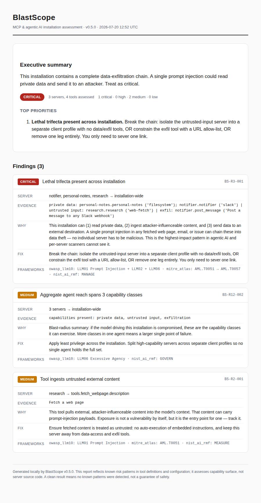

# BlastScope

> **See your agent's blast radius before an attacker does.**

Security posture assessment for MCP and agentic AI installations — built by a practising CISO, designed for the people who have to *govern* AI agents, not just deploy them.

<!-- Badges: add after first release -->
<!-- [PyPI] [License: Apache-2.0] [CI] [OWASP LLM Top 10 mapped] -->

<!-- DEMO GIF HERE: 30s — `blastscope scan` on a messy config → CRITICAL posture → fix two findings → re-scan → clean -->

---

## The problem

MCP servers are being installed the way browser toolbars were in 2005: copy a config from a README, restart the client, hope for the best.

Most existing scanners answer a useful question: *"Is this server misconfigured?"* BlastScope answers the question that actually keeps security leaders up at night:

> **"If the model driving this installation is compromised by a single prompt injection, what is the total blast radius — and can I explain it to my board?"**

That is a different question. It's about the **composition** of everything you've installed, not any single server in isolation. A read-only email server is fine. A web fetcher is fine. A webhook poster is fine. Install all three and you've built a data exfiltration pipeline that no per-server scan will ever flag.

## Why another scanner? (Honest answer)

Good tools already exist in this space — mcp-scan, agent-audit, agent-audit-kit, Snyk's agent-scan, mcp-audit, and others. If you want per-server rule coverage or code-level SAST of MCP servers, several of those are excellent and you should use them. BlastScope deliberately does not compete on rule count.

What BlastScope does that we haven't found elsewhere:

| Capability | Typical scanner | BlastScope |
|---|---|---|
| Unit of analysis | One server / one config | **The whole installation, as a system** |
| Composition risk (cross-server capability chains) | Rare or partial | **Core feature — the "lethal trifecta" and beyond** |
| Primary output | Findings list / SARIF | **Blast-radius posture + board-ready risk narrative** (SARIF too) |
| Written for | AppSec engineers | **Security leaders AND safe experimenters** |
| Risk framing | Rule-based severity | **Severity × exploitability × blast radius, with business-impact language** |

If your reaction is "a findings list is enough for me" — genuinely, use one of the tools above. If you've ever had to stand in front of a risk committee and explain what your organisation's AI agents can actually *do*, keep reading.

## Quick start

```bash
pipx install blastscope

# Scan whatever MCP clients are installed on this machine (auto-detected)
blastscope scan
```

Sixty seconds later:

```
BlastScope v0.5 — Installation Assessment
──────────────────────────────────────────
Clients found:   Claude Desktop, Cursor
Servers found:   7        Tools exposed: 43

  POSTURE:  CRITICAL          11 findings

  ⛔ TRIFECTA DETECTED (Critical)
     Your installation combines:
       • Private data access ......... gmail-mcp (read_email)
       • Untrusted content ingress ... web-fetch (fetch_url)
       • Exfiltration path ........... hooks-mcp (post_webhook)
     A single successful prompt injection in ANY fetched web page
     can read your email and send it to an attacker-controlled URL.
     → Remediation: isolate web-fetch into a separate client profile,
       or constrain post_webhook with a URL allow-list.

  🔴 3 Critical   🟠 5 High   🟡 6 Medium   (blastscope report for detail)

  One-line verdict: this setup can read your email and post it
  anywhere on the internet. Treat as Critical until remediated.
```

Check a server **before** you install it:

```bash
blastscope inspect npx:@vendor/mcp-server-foo
blastscope inspect https://mcp.vendor.example/sse
```

## What it detects

Twelve risk classes, shipped as versioned, user-extensible YAML rule packs. Every finding carries evidence, plain-English explanation, remediation, and mappings to **OWASP LLM Top 10, MITRE ATLAS, and NIST AI RMF**.

| ID | Risk class | One-liner |
|----|-----------|-----------|
| R1 | Tool poisoning | Hidden/manipulative instructions in tool names and descriptions (incl. invisible Unicode, encoded blobs) |
| R2 | Injection surface | Tools that pipe untrusted external content into model context |
| R3 | **Lethal trifecta** | Private data + untrusted content + exfiltration path, assessed **across servers** |
| R4 | Over-permissioning | Write/exec where read suffices; wildcard scopes; filesystem roots |
| R5 | Rug pull | Tool definitions that can silently change after approval (baseline hashing + drift detection) |
| R6 | Tool shadowing | Name collisions and call-interception across installed servers |
| R7 | Credential exposure | Secrets in plaintext configs, args, and manifests |
| R8 | Transport & auth | Unauthenticated remote servers, missing TLS, weak session binding |
| R9 | Destructive actions | Irreversible tools (delete/send/pay) with no confirmation semantics |
| R10 | Supply chain | Unpinned versions, unverifiable publishers, install-time scripts |
| R11 | Exfiltration vectors | Arbitrary-URL parameters, unbounded egress, writes to public locations |
| R12 | **Excessive agency (composition)** | Aggregate blast radius of the full installed set |

R3 and R12 are why this project exists. Everything else is table stakes done properly.

## For security teams

```bash
# CI gate: fail the build on high-severity findings
blastscope scan --fail-on high

# Live handshake — enumerate real tools/resources/prompts, not just declared config
blastscope scan --live

# Record a rug-pull baseline now, then re-run on a schedule (cron/CI) to catch drift
blastscope scan --baseline
blastscope watch

# Pre-install check before anything touches a client config
blastscope inspect npx:@vendor/mcp-server-foo

# The one your CISO actually wants:
blastscope scan --format html -o ai-agent-risk.html
```

`--format html` produces a one-page narrative report: what the installation can do, what the realistic attack path is, and the top remediations — written in risk-register language, not stack traces. See [`examples/sample-report.html`](examples/sample-report.html) for a full sample, or the screenshot below. Drop it into your GRC pack as-is.



A policy engine (org-defined capability rules, `blastscope scan --policy corp-baseline.yaml`) and SARIF output for the GitHub Security tab are planned for v1.0 — see [Roadmap](#roadmap).

## For experimenters

You don't need a security team to use this. If you're learning MCP, building agents, or following along with agentic AI content, BlastScope is the seatbelt:

- **Zero config.** `blastscope scan` finds your clients and just works.
- **Plain English.** Every finding explains *why it matters* and *what to do*, no security background assumed.
- **Pre-install checks.** `blastscope inspect <server>` before you paste anything into your config.
- **Nothing leaves your machine.** See below.

## Design principles

1. **Local-first, no telemetry, no phone-home.** Static analysis runs fully offline. Nothing about your configuration is ever transmitted. This is a security tool; it behaves like one.
2. **Deterministic first.** Core detection is rule-based: same input, same findings, no model in the loop. An *optional* LLM semantic pass (for subtle manipulative language in tool descriptions) exists behind an explicit flag with your own API key, and its findings are labelled heuristic.
3. **Handshake with consent.** Live inspection of stdio servers means executing them. BlastScope shows you the exact command and asks first, every time. Scanning untrusted servers should be done in a sandbox — the docs show you how.
4. **Explainable or it doesn't ship.** Every finding cites its rule, its evidence, and its framework mapping. No black-box scores.
5. **Honest limitations.** BlastScope assesses capability surface, not server source code (use a SAST tool for that), and a CLEAN result means "no known risk patterns detected", not "safe".

## Framework support

| Source | Status |
|--------|--------|
| MCP client configs (Claude Desktop / Claude Code, Cursor, VS Code, Windsurf, `--config <path>`) | ✅ v0.1 |
| MCP live handshake (tool/resource/prompt enumeration) | ✅ v0.5 |
| OpenAI function-calling schemas | 🔜 v1.0 |
| LangChain tool definitions | 🔜 v1.0 |
| CrewAI / AutoGen | Planned |
| Adapter plugin API (bring your own framework, <100 lines) | 🔜 v1.0 |

All adapters normalise into one internal capability model; the rule engine is framework-agnostic by construction.

## Roadmap

- **v0.1** — static config scanning, R1/R4/R7/R9/R10, severity-based posture, terminal + JSON ✅
- **v0.5 (current)** — live handshake, composition engine (R3/R12), R2/R5/R8/R11 rules, `inspect` pre-install check, rug-pull drift baselines, HTML boardroom report
- **v1.0** — policy engine, SARIF + GitHub Action, OpenAI/LangChain adapters, optional LLM pass
- **Beyond** — runtime guardrail mode reusing the same rule engine, community rule registry, AI-BOM export

## Threat model

The full threat model this tool is built against — what we assume about attackers, clients, and servers — lives in [`docs/THREAT-MODEL.md`](docs/THREAT-MODEL.md). Read it before trusting any scanner, including this one.

## Contributing

Rule packs are plain YAML — contributing a detection doesn't require touching engine code. See [`CONTRIBUTING.md`](CONTRIBUTING.md). Good first issues are tagged.

## About

Built by **Marius Poskus** — Global VP of Cybersecurity / CISO at an FCA-regulated FinTech, 14 years in security, and creator of **CTRL+ALT+DEFEND** (cybersecurity career education, 60K+ across platforms).

I evaluate agentic AI the way I evaluate any privileged system, because that's what it is. BlastScope is that evaluation, automated.

- LinkedIn: [linkedin.com/in/YOURHANDLE]
- YouTube / TikTok: @ctrlaltdefend
- Consulting: [mpcybersecurity.co.uk]

## License

Apache-2.0

---

*BlastScope provides visibility, not guarantees. Use it alongside runtime controls, sandboxing, and your own judgement.*
